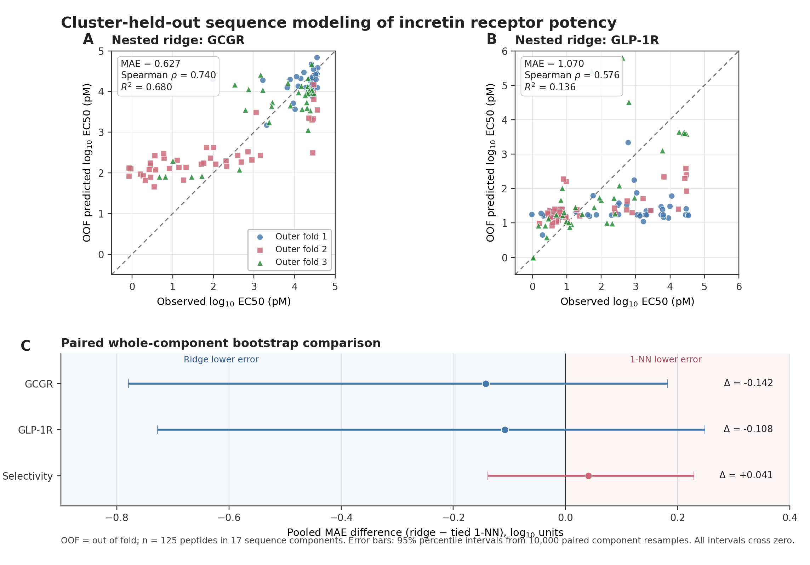

# IncretinSelect-AI

[](https://github.com/darwinxcai/IncretinSelect-AI/actions/workflows/ci.yml)
[](https://darwinxcai.github.io/IncretinSelect-AI/)
[](https://github.com/darwinxcai/IncretinSelect-AI/actions)

**[Open the browser application](https://darwinxcai.github.io/IncretinSelect-AI/)**
· [Read the current project state](PROJECT_STATE.md)
· [Read the model report](reports/CPU_SEQUENCE_MODEL.md)
· [Read the external evaluation](reports/EXTERNAL_EVALUATION.md)

IncretinSelect-AI is a reproducible ridge-regression benchmark and research
application for estimating GLP-1R and GCGR cAMP EC50 from incretin-like peptide
sequences. It accepts canonical 26–30-residue local analogs and maps them into the
frozen model's 30-column coordinate system only when that mapping is unambiguous.
The model was trained on 125 peptides measured in a matched cell assay and evaluated
with sequence-component-held-out cross-validation against a tied 1-nearest-neighbor
(1-NN) baseline.

The released model is intended for exploratory comparison of close sequence
analogs. In development cross-validation, ridge had lower pooled MAE for GCGR and
GLP-1R than 1-NN, but all comparison intervals included zero and the potency-ratio
endpoint did not improve. In the locked retrospective P1–P15 external evaluation,
ridge had lower GCGR point error and higher pooled GLP-1R error. These mixed
results do not establish overall superiority or support standalone candidate
selection.

## Try it in 30 seconds

1. Open the [browser application](https://darwinxcai.github.io/IncretinSelect-AI/);
   a compatible example sequence is already loaded.
2. Select **Run prediction**.
3. Read the result in this order: **predicted EC50**, **model applicability**, then
   **comparison with the closest development sequence**.

Lower predicted EC50 means greater predicted functional potency only in the source
cell-assay context. The applicability gate determines whether the software permits
exploratory comparison; it is not a confidence score. A numeric estimate is not a
candidate recommendation. All computation remains in your browser.

## Results at a glance

At an aligned-identity threshold of 0.85, the 125 development peptides formed 17
connected components. The components were assigned intact to three outer folds of
42, 42, and 41 peptides, with model selection confined to each outer training set.

| Endpoint | 1-NN MAE | Ridge MAE | Ridge Spearman rho | Ridge R2 |
|:---|---:|---:|---:|---:|
| GCGR log10(EC50 / 1 pM) | 0.769 | 0.627 | 0.740 | 0.680 |
| GLP-1R log10(EC50 / 1 pM) | 1.178 | 1.070 | 0.576 | 0.136 |
| log10(GCGR EC50 / GLP-1R EC50) | 1.095 | 1.136 | 0.538 | 0.034 |

All paired whole-component bootstrap intervals for the ridge-minus-1-NN MAE
difference included zero. Performance also varied substantially across outer folds.
These results describe this dataset and model; they do not establish broad
generalization to unrelated peptide families.



In the 15-peptide retrospective evaluation, the GCGR constraint-MAE difference
favored ridge by 0.241 log10 units, but its four-component descriptive interval
[-0.818, 0.343] crossed zero. Pooled GLP-1R MAE was 1.699 for ridge and 1.361 for
1-NN. The potency-ratio result was exploratory because no component-resampling
uncertainty analysis was predeclared for that secondary endpoint. Full methods,
censoring rules, and sensitivity analyses are reported in
[`reports/EXTERNAL_EVALUATION.md`](reports/EXTERNAL_EVALUATION.md).

## What the application does

For one compatible sequence, the application reports:

- predicted GLP-1R and GCGR cAMP EC50 as log10(EC50 / 1 pM), pM, and nM;
- a plain-language receptor profile derived from the predicted potency ratio,
  defined as GCGR EC50 / GLP-1R EC50;
- aligned identity to the nearest reference sequence and an exact additive
  comparison with that reference;
- a separate applicability assessment, validation context, and limitations; and
- downloadable JSON, CSV, or Markdown results.

A positive log10 potency ratio indicates lower predicted EC50 at GLP-1R; a negative
value indicates lower predicted EC50 at GCGR. Lower EC50 indicates greater
functional potency in the source cell assay. EC50 does not measure binding affinity,
maximal assay response, safety, in vivo activity, or clinical benefit.

The batch workflow accepts a CSV and ranks eligible rows using one of three
objectives: minimize predicted GLP-1R EC50, minimize predicted GCGR EC50, or
minimize the larger of the two predicted EC50 values. The last option is a
transparent sorting rule for potency at both receptors, not evidence of dual
agonism. Each ranked row also reports its score difference from the top-ranked row and
whether that difference is within one development-set MAE. This is context for
reading the ordering, not an individual confidence interval.

## Use the browser application

The public [browser application](https://darwinxcai.github.io/IncretinSelect-AI/)
runs the released coefficients without installation. It supports one FASTA or text
sequence, CSV batch screening, and local JSON/CSV/Markdown downloads. Imported
sequences and calculations remain in the browser; no sequence data are transmitted
to a backend or analytics service. The application verifies both the model and
raw-sequence adapter checksums before enabling prediction.

To serve the same application from a local checkout:

```bash
python -m http.server 8000 --directory docs
```

Then open `http://127.0.0.1:8000`. Browser predictions are checked against the
Python package across all 601 deterministic single-position variants of a reference
sequence, including applicability and nearest-reference attribution. Browser batch
behavior and exported fields are also checked against the Python implementation.
The raw adapter round-trips all 125 label-free reference sequences, and explicit
ambiguity, distance, gap, and no-truncation cases must match across both runtimes.
Real-Chromium acceptance tests additionally exercise the complete single-prediction
and batch-download workflows and scan the initial and rendered interfaces for WCAG
2.1 A/AA and WCAG 2.2 AA accessibility violations.
The Python suite records branch coverage and enforces a measured 70% floor as an
initial regression ratchet; this is a maintenance signal, not evidence of scientific
validity.

## Input requirements

The default input is one canonical 26–30-residue peptide, using ASCII representations
of the 20 standard amino-acid letters. For example:

```text
HSQGTFTSDYSKYLDSRAASEFVQWLISH
```

The frozen ridge model still consumes exactly 30 alignment columns. A separate,
checksum-bound, label-free adapter projects a raw sequence into those columns only
when all best-scoring reference-guided mappings agree and the mapped sequence is at
least 85% identical to the reference panel. It never removes residues or trims a
longer construct. Ambiguous mappings, sequences outside 26–30 residues, and raw
sequences outside the local-analog gate are rejected with an explanation.

Expert users may instead supply a reviewed 30-column alignment with explicit `-`
gaps. This mode permits transparent inspection outside the automatic adapter's
scope, but out-of-scope results remain ineligible for ranking. The `-` symbol is an
alignment gap, not a linker, cleavage, or chemical modification. Neither input mode
represents Aib, lipidation, amidation, cyclization, stapling, D-amino acids, or other
noncanonical chemistry.

Ranking is limited by two software gates:

1. nearest-reference aligned identity must be at least 0.85; and
2. the aligned input must contain at least 26 standard residues.

The 0.85 value defined sequence components in the development benchmark. The
application reuses it as a software gate; it is not calibrated to prediction
accuracy or confidence. Valid inputs outside either gate retain their numeric
extrapolations but receive no rank and include an exclusion reason.

The installed package also carries the checksum-pinned source manifest, activity
schema, and curated structure seed panel. They can be inspected without a repository
checkout or network request:

```bash
incretin-fetch --list-sources
incretin-validate --print-schema
incretin-structures --list-seeds
```

## Screen a candidate table

The preferred CSV schema uses raw peptide sequences:

```text
candidate_id,sequence
variant_a,HSQGTFTSDYSKYLDSRAASEFVQWLISE
```

For reviewed expert inputs, the legacy schema
`candidate_id,aligned_sequence` remains available and requires exactly 30 columns.
Raw-sequence files are limited to 200 rows and repeated sequences are aligned once
per run; the larger expert-alignment limits remain documented in the product guide.

Then choose a ranking objective:

```bash
incretin-screen examples/candidate_screening/candidates.csv \
  --objective dual \
  --output screened.csv \
  --receipt screening_receipt.json
```

`glp1r` and `gcgr` rank lower predicted receptor-specific EC50 first. `dual` ranks
candidates by the larger, less favorable of the two predicted
log10(EC50 / 1 pM) values, with lower scores first. Invalid and out-of-scope rows
remain in the output with an explicit status. The JSON receipt records the input
and output checksums, objective, model version, row counts, and ranking policy. See
[`examples/candidate_screening/`](examples/candidate_screening/) for a checked
example that exercises software behavior without using P1–P15 outcome labels.

## Install the Python package

Python 3.10 or newer is required.

```bash
git clone https://github.com/darwinxcai/IncretinSelect-AI.git
cd IncretinSelect-AI
python -m venv .venv
. .venv/bin/activate             # Windows PowerShell: .venv\Scripts\Activate.ps1
python -m pip install .

# Run the bundled example
incretin-predict --example

# Start the packaged browser application locally
incretin-web --open
```

Machine-readable output is available from the command line:

```bash
incretin-predict HSQGTFTSDYSKYLDSRAASEFVQWLISH --format json
incretin-predict HSQGTFTSDYSKYLDSRAASEFVQWLISH --format csv --output result.csv
incretin-predict --sequence-file candidate.fasta --format markdown --output result.md
incretin-predict HSQGTFTSDYSKYLDSRAASEFVQWLISH- --aligned --format json
incretin-predict --model-info
```

## Evaluation design

The 125-peptide development set comes from Puszkarska *et al.* (2024) and uses one
matched CHO-cell cAMP assay framework for both receptors. Closely related sequences
were grouped into connected components before splitting so that no pair with at
least 0.85 aligned identity crossed an outer-fold boundary. A 630-feature one-hot
encoding—21 symbols across 30 positions—was fit with multi-output ridge regression.
Ridge strength was selected by leave-one-component-out validation within each outer
training set, and each component received equal total fitting weight.

The source study prospectively synthesized and tested P1–P15. Their outcomes were
already public when this project began, so this repository treats them as a locked
retrospective P1–P15 external evaluation rather than a blinded or prospective test.
Predictions, dependence groups, protocol, and checksums were committed before the
separate scoring command accessed receptor outcomes. Right-censored measurements
remained one-sided bounds; they were not converted to exact values.

## Reproduce the release

Use a GitHub checkout or the complete source distribution for full reproduction;
the wheel contains the installed application and its runtime resources.

```bash
python -m venv .venv
. .venv/bin/activate
python -m pip install -e ".[dev]"
make test
make product-smoke
make static-demo
make release-check
```

To reproduce the CPU benchmark, first fetch the checksum-pinned public training
workbook and then run the analysis scripts:

```bash
python scripts/fetch_public_data.py \
  --source puszkarska_2024_training \
  --output-dir data/raw
python scripts/validate_activity_dataset.py \
  data/raw/training_data.xlsx \
  --json-output reports/activity_validation.json
python scripts/freeze_sequence_splits.py
python scripts/run_cpu_baseline.py
python scripts/run_cpu_sequence_model.py
python scripts/plot_cpu_sequence_model.py
```

The P1–P15 outcome scorer is intentionally excluded from routine reproduction so
that the locked retrospective result is not reused as a tuning loop. The checked-in
metrics and figure can be regenerated with `make post-score-figure`.

## Repository guide

| Path | Contents |
|:---|:---|
| `src/incretinselect/` | Inference, evaluation, and command-line code |
| `docs/` | Static browser application |
| `configs/` | Versioned schemas, thresholds, and model policies |
| `data/derived/` | Frozen splits and machine-generated result tables |
| `reports/` | Methods, metrics, figures, and verification records |
| `tests/` | Offline unit and integration tests |

The release check builds the wheel and source distribution separately, installs
the wheel outside the repository, rebuilds it from the source distribution, and
runs the source distribution's tests and product checks.

## Sources and licensing

The experimental data are from Puszkarska *et al.*, *Nature Chemistry* (2024),
[doi:10.1038/s41557-024-01532-x](https://doi.org/10.1038/s41557-024-01532-x),
with source files from [amp91/PeptideModels](https://github.com/amp91/PeptideModels).
Project code is MIT-licensed. Upstream and derived data retain their original terms;
see [`DATA_LICENSE.md`](DATA_LICENSE.md). Cite the primary experimental study when
using the model or derived results.
