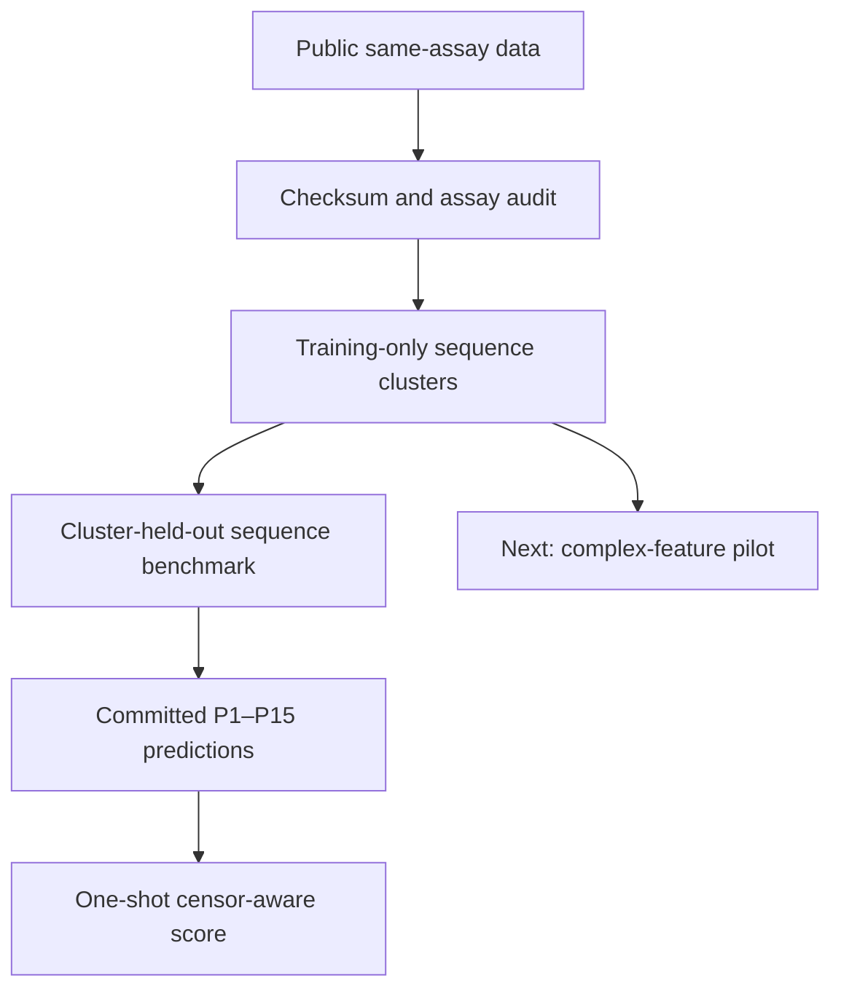

# IncretinSelect-AI

**Can a peptide's amino-acid sequence help researchers choose which incretin
candidates are worth testing in the lab? This project builds and honestly tests a
machine-learning tool for that decision.**

## The purpose

Researchers developing peptide medicines can make many slightly different
sequences, but every candidate still needs experimental testing. A useful computer
model could act as an early screening filter: estimate how a candidate is likely
to behave, then help researchers decide which peptides deserve limited lab time
and material first.

Incretin-based peptides are hormone-like molecules used and studied for metabolic
diseases such as diabetes and obesity. Researchers are also exploring versions
that deliberately act on more than one biological target.

Put simply: if a lab has 100 possible sequences but can test only 10, the eventual
use case is to help choose those 10. The current project tests whether the
predictions are dependable enough to move toward that use case.

IncretinSelect-AI tests that idea for two cell receptors used in metabolic-drug
research:

- **GLP-1R** is the glucagon-like peptide-1 receptor.
- **GCGR** is the glucagon receptor.

Some experimental medicines are designed to activate both receptors. The balance
between them matters, because a peptide that is strong at one receptor and weak at
the other is biologically different from one that activates both similarly.

The immediate objective is simple:

> Learn from previously tested peptide sequences, predict how strongly new
> candidate sequences will activate GLP-1R and GCGR in a cell assay, and check
> whether those predictions are more useful than copying the result from the most
> similar known peptide.

## What goes in and what comes out

| | Meaning |
|:---|:---|
| **Input** | The order of amino acids in one peptide candidate. |
| **Output 1** | Predicted functional potency at GLP-1R. |
| **Output 2** | Predicted functional potency at GCGR. |
| **Output 3** | The predicted balance between the two receptor potencies. |

Here, **functional potency** means the peptide concentration needed to produce half
of the measured maximum cAMP signal in cells (EC50). cAMP is the assay's readout
of receptor activation. A lower EC50 means that less peptide was needed to reach
that response. This is **not binding affinity**: the project does not directly
measure how tightly the peptide physically binds the receptor, and it does not
predict whether a drug is safe or works in people.

The model does not invent new peptides. It estimates the lab response of a supplied
sequence so that candidates could eventually be ranked for experimental follow-up.

## Try the zero-install browser demo

The repository now includes a static demo that runs the exact frozen model in a
web browser. There is no backend, external API, analytics, account, or sequence
upload. The browser verifies the model checksum before enabling prediction.

From a downloaded source archive, run:

```bash
python -m http.server 8000 --directory docs
```

Then open `http://127.0.0.1:8000`. After the public repository exists, the same
checked demo deploys automatically through GitHub Pages. Browser predictions are
tested against Python on 12 label-free reference sequences at a tolerance of
`1e-12`. See [`docs/README.md`](docs/README.md) and the machine-readable
[`static_demo_verification.json`](reports/static_demo_verification.json).

## Use the finished local Python app

Version 0.5 includes a frozen, portable model that works without downloading the
raw experimental workbooks and without calling an external API. After installing
the repository, you can predict from the terminal or open a local browser app.

```bash
python -m venv .venv
. .venv/bin/activate             # Windows PowerShell: .venv\Scripts\Activate.ps1
python -m pip install -e .

# Run a checked example in the terminal
incretin-predict --example

# Open the local interface at http://127.0.0.1:8000
incretin-web --open
```

Paste an already-aligned 30-position peptide core into the app. For example:

```text
HSQGTFTSDYSKYLDSRAASEFVQWLISH-
```

The `-` is an alignment gap, not a chemical bond break. Input may contain only the
20 standard amino acids plus alignment gaps. This strict contract is intentional:
the published model used a curated 30-column alignment, and its source data sometimes
removed terminal linker residues from longer constructs. The app therefore refuses
to guess an alignment, silently trim a sequence, or pretend to encode lipidation,
Aib, amidation, and other chemistry. If you have an unaligned raw sequence, first
place it into the study's 30-position alignment and review that mapping yourself.

For machine-readable output:

```bash
incretin-predict HSQGTFTSDYSKYLDSRAASEFVQWLISH- --format json
incretin-predict HSQGTFTSDYSKYLDSRAASEFVQWLISH- --format csv --output result.csv
incretin-predict --model-info
```

### Screen a shortlist in one command

Put multiple already-aligned variants in a CSV, choose the biological goal, and
get one review table:

```bash
incretin-screen examples/candidate_screening/candidates.csv \
  --objective dual \
  --output screened.csv \
  --receipt screening_receipt.json
```

The required columns are `candidate_id,aligned_sequence`. The objective must be
explicit:

- `glp1r` puts lower predicted GLP-1R EC50 first;
- `gcgr` puts lower predicted GCGR EC50 first;
- `dual` minimizes the less favorable of the two receptor predictions.

The tool ranks only close analogues with at least 26 standard residues. Invalid,
distant, or shorter rows stay in the output with a reason, so nothing disappears
silently. Duplicate IDs stop the run; duplicate sequences remain visible and tie.
Every run also creates a JSON receipt that binds the input and output checksums,
objective, model version, row counts, and scientific boundaries.

“Dual” is a transparent sorting rule, not proof of dual agonism, and a rank is an
exploratory model ordering rather than an experimental recommendation. The
checked example uses three anonymized development sequences from the model's
label-free reference list plus one artificial all-alanine guardrail row. It
contains no assay outcomes and no P1–P15 rows. Because those three reference
sequences were used to fit the model, the example proves software behavior—not
predictive accuracy. See
[`examples/candidate_screening/`](examples/candidate_screening/).

Every prediction includes GLP-1R and GCGR `log10(pM)`, pM, and nM estimates; the
derived EC50 ratio; nearest-reference sequence identity; model version and
checksum; benchmark error context; and warnings. Lower EC50 means greater
functional potency in the cell assay. It does **not** mean tighter binding.

Run the complete offline verification:

```bash
make test
make product-smoke
make static-demo
make release-check
```

The smoke test reproduces the prediction that was frozen before external scoring,
checks guarded batch screening on label-free rows, and renders terminal, CSV, and
web results using only checked-in files. See
[`reports/PRODUCT_GUIDE.md`](reports/PRODUCT_GUIDE.md) for input rules, output
interpretation, provenance, and limitations.

`make release-check` also builds the wheel, installs it into a temporary
environment, and runs the public JSON, CSV, and browser commands from outside the
repository. This catches packaging mistakes that an editable development install
can hide and writes an inspectable receipt to
`reports/distribution_verification.json`.

The guarded public-repository procedure is documented in
[`PUBLISHING.md`](PUBLISHING.md). Its default command is a non-mutating preflight;
an explicit `--execute` is required to create the public repository and push the
exact clean `main` commit.

`make release-readiness` audits the evidence boundary between a locally complete
package and a publicly CV-verifiable release. Its checked-in receipt and the
post-publication evidence command are documented in
[`RELEASE_READINESS.md`](RELEASE_READINESS.md).

## Why this is useful

If these predictions become reliable, they could reduce the number of low-priority
candidates taken into early cell experiments. Just as importantly, the project
tests whether the model really learned something transferable instead of merely
remembering close relatives from its training data.

This release is the **sequence-only baseline**. Establishing that baseline is
necessary before the next research question—whether predicted 3D peptide–receptor
structures add useful information beyond sequence alone. A convincing-looking 3D
pose is not automatically evidence that a peptide will work in cells.

## What was built

- A cleaned, reproducible dataset of **125 peptides** measured in the same cell
  assay.
- A test design that keeps closely related peptide families together, making the
  model predict families it did not train on rather than rewarding memorization.
- A sequence model compared with a deliberately simple rule: use the result from
  the most similar previously measured peptide.
- A separate one-time check on **15 additional peptide designs**, with predictions
  saved before their outcomes were scored. The outcomes were already public, so
  this was a carefully separated re-check rather than a blinded new experiment.
- Tested code, fixed data checks, figures, and machine-readable result files so the
  full analysis can be audited and reproduced on a CPU.

## Result in plain English

The learned sequence model showed **some useful signal, but it was not a reliable
overall winner**.

- During development testing, it made smaller average errors for GLP-1R and GCGR
  potency than the simple comparison, but not for the balance between receptors.
  The uncertainty was large enough that these improvements were not decisive.
- On the separate 15-peptide check, it did better for GCGR but worse for GLP-1R.
  Therefore, there is **no overall external superiority result**.
- The receptor-balance result looked encouraging in a small subset, but that
  analysis was exploratory and cannot support a firm claim.

In practical terms, this version proves that the full research workflow works, but
the model is **not yet dependable enough to choose drug candidates on its own**.
The value of the result is that it shows where sequence alone helps, where it
fails, and exactly what a future structure-aware model must beat before it can
claim to improve experimental prioritization.

## Technical benchmark results

The benchmark uses the 125 peptides measured under one matched assay in
Puszkarska *et al.* (2024). The paper's prospectively synthesized P1–P15 designs
were scored exactly once from a committed prediction lock as a censor-aware
external evaluation. They remained excluded from threshold selection, fold
construction, feature choices, hyperparameter selection, and model fitting.
Their labels are public, so this is a retrospective local-analogue test—not a new
blinded or prospective experiment.

The development benchmark and one-shot external evaluation are complete and
fully reproducible on CPU:

- **125** same-assay training peptides, checksum-pinned and validated;
- **17** connected sequence components at the frozen 0.85 identity boundary;
- deterministic outer folds of **42 / 42 / 41** records;
- maximum cross-fold aligned identity **0.8333**;
- a zero-tuning, tied 1-nearest-neighbour baseline evaluated on every record;
- a 630-feature aligned-sequence ridge model with nested, leave-one-component-out
  tuning and component-balanced fitting.

| Endpoint | 1-NN MAE (log10) | Ridge MAE (log10) | Ridge Spearman rho | Ridge R2 |
|:---|---:|---:|---:|---:|
| GCGR EC50 | 0.769 | 0.627 | 0.740 | 0.680 |
| GLP-1R EC50 | 1.178 | 1.070 | 0.576 | 0.136 |
| log10 potency-selectivity ratio | 1.095 | 1.136 | 0.538 | 0.034 |

Ridge lowers pooled MAE for both receptor potencies, but not for selectivity, and
all paired component-bootstrap intervals include zero. Component-macro summaries
also show weaker GLP-1R and selectivity transfer than pooled MAE. The honest result
is therefore mixed rather than a blanket win. High fold-to-fold variability
remains important: sequence models do not transfer uniformly once close analogues
are kept together. Full development-CV methods and precision are in
[`reports/CPU_SEQUENCE_MODEL.md`](reports/CPU_SEQUENCE_MODEL.md); the original
zero-tuning comparator remains in [`reports/CPU_BASELINE.md`](reports/CPU_BASELINE.md).


Negative MAE differences in panel C favor ridge. The point estimates favor ridge
for GCGR and GLP-1R potency, but every whole-component bootstrap interval crosses
zero; selectivity's point estimate favors 1-NN.

### One-shot P1–P15 external result

There is **no overall external superiority result**. Against the predeclared tied
1-NN comparator, ridge has a favorable GCGR constraint-MAE point difference of
**-0.241** log10 units, but its four-component descriptive interval
**[-0.818, 0.343]** and leave-one-component-out range **[-0.553, 0.047]** cross
zero. For GLP-1R, ridge is worse in the pooled result: **1.699 versus 1.361** MAE,
a difference of **+0.337**. That conclusion is dependence-sensitive: external-
component mean differences span **-2.120 to +1.380**, and leaving out one
component moves the result from **-0.184 to +0.513**.

The GLP-1R pooled difference is positive even though all three predeclared group-
macro differences are negative. This pooled-versus-macro sign reversal means the
answer changes with weighting of the related, unequally sized design groups; a
macro-only stability flag is not evidence of overall stability. Exploratory
selectivity results are promising on ten exact cases (MAE **0.427 versus 0.622**),
but were not given predeclared component-level uncertainty and are not a headline
win. See [`reports/EXTERNAL_EVALUATION.md`](reports/EXTERNAL_EVALUATION.md) for
the censoring rules, all comparators, dependence sensitivities, and negative
results.


## Locked workflow



The structural branch is the next research phase. It will first benchmark native
and matched multi-receptor complexes against cryo-EM structures, quantify
seed-to-seed stability, and only then extract a small predeclared feature set.

## Scientific boundaries

- The endpoint is cell-based cAMP **EC50**: functional potency, not binding
  affinity, efficacy, Kd, or delta-delta-G.
- A confident predicted complex is not evidence that a peptide is active.
- Sequence families/components, not individual analogues, define outer folds.
- A historical parser read published P1–P15 outcomes for checksum and censoring
  audits. Only the post-lock scorer used them for prediction-error metrics, and
  they never guided modeling decisions. The command-level separation and hashes
  are recorded, but the public-label evaluation is not blinded.
- Right-censored measurements remain bounds; they are never converted into exact
  values. The training workbook has 250 numeric endpoint labels, while the locked
  prospective workbooks include censored replicates.
- Lipidation, Aib, amidation, and other noncanonical chemistry must be represented
  explicitly before affected structures enter quantitative comparisons.
- GIPR/triple-agonist structures are context, not a supervised endpoint in this
  matched 125-peptide dataset.

## Repository map

```text
configs/                 Frozen schemas, thresholds, and structure targets
data/manifests/          Source provenance, licenses, URLs, and checksums
data/raw/                Downloaded upstream files (gitignored)
data/derived/            Frozen splits and machine-generated predictions
reports/                 Audits, exact metrics, and scientific decisions
scripts/                 Reproducible command-line workflow
src/incretinselect/      Tested parsers, clustering, and baseline code
tests/                   Offline synthetic unit tests
```

## Quick start

Python 3.10 or newer is required.

```bash
python -m venv .venv
. .venv/bin/activate
python -m pip install -e ".[dev]"
make test
```

Reproduce the checked-in CPU results from the checksum-verified training workbook:

```bash
python scripts/fetch_public_data.py \
  --source puszkarska_2024_training \
  --output-dir data/raw
python scripts/validate_activity_dataset.py \
  data/raw/training_data.xlsx \
  --json-output reports/activity_validation.json
python scripts/freeze_sequence_splits.py
python scripts/run_cpu_baseline.py
python scripts/run_cpu_sequence_model.py
python scripts/plot_cpu_sequence_model.py
make post-score-figure
```

`post-score-figure` only re-renders the checked-in external metrics and receipt.
The one-shot outcome scorer is intentionally not part of routine reproduction and
must not be rerun as a tuning loop.

Or, after all source workbooks have been downloaded, run:

```bash
make audit
```

`make reproduce` additionally downloads all pinned public files and refreshes the
RCSB structure manifest. Raw workbooks are intentionally not committed.

## Auditable artifacts

- [`reports/SEQUENCE_SPLIT_AUDIT.md`](reports/SEQUENCE_SPLIT_AUDIT.md): threshold
  rule, all candidates, and cross-fold leakage check.
- [`data/derived/outer_folds.csv`](data/derived/outer_folds.csv): frozen peptide
  assignments.
- [`data/derived/baseline_oof_predictions.csv`](data/derived/baseline_oof_predictions.csv):
  one out-of-fold prediction per training peptide.
- [`data/derived/sequence_model_oof_predictions.csv`](data/derived/sequence_model_oof_predictions.csv):
  nested ridge and matched 1-NN predictions on the identical outer folds.
- [`data/derived/cpu_sequence_model_figure_source.csv`](data/derived/cpu_sequence_model_figure_source.csv):
  complete OOF and paired-comparison source table for the PNG/SVG figure.
- [`reports/cpu_baseline_metrics.csv`](reports/cpu_baseline_metrics.csv): compact
  machine-readable result table.
- [`reports/cpu_sequence_model_metrics.csv`](reports/cpu_sequence_model_metrics.csv):
  pooled and component-macro ridge comparison metrics.
- [`reports/HOLDOUT_AUDIT.md`](reports/HOLDOUT_AUDIT.md): censoring, overlap, and
  evaluation policy for P1–P15.
- [`configs/external_evaluation.json`](configs/external_evaluation.json): locked
  model-fitting, censoring, comparator, and dependence-analysis protocol.
- [`data/derived/external_predictions_locked.csv`](data/derived/external_predictions_locked.csv):
  label-independent predictions committed before outcome scoring.
- [`data/derived/external_dependency_groups.csv`](data/derived/external_dependency_groups.csv):
  frozen label-free dependence group assignments.
- [`reports/external_prediction_receipt.json`](reports/external_prediction_receipt.json):
  pre-score hashes, accessed-path record, and prediction-lock provenance.
- [`data/derived/external_evaluation_records.csv`](data/derived/external_evaluation_records.csv):
  45 peptide-endpoint observations with exact/bound status and model losses.
- [`reports/external_evaluation_metrics.csv`](reports/external_evaluation_metrics.csv)
  and [`reports/external_evaluation_receipt.json`](reports/external_evaluation_receipt.json):
  machine-readable metrics, uncertainty summaries, hashes, and scoring receipt.
- [`data/derived/external_evaluation_figure_source.csv`](data/derived/external_evaluation_figure_source.csv):
  complete source for the external-evaluation PNG/SVG.
- [`data/manifests/sources.json`](data/manifests/sources.json): exact provenance
  and SHA-256 values.
- [`data/derived/structures.csv`](data/derived/structures.csv): fully resolved
  receptor/peptide entity and chain metadata for the 10-entry RCSB seed panel.

## Next milestone

The next go/no-go checkpoint is a small, preregistered complex-prediction pilot:

1. benchmark native GLP-1–GLP-1R and glucagon–GCGR anchors plus a matched
   multi-receptor peptide panel;
2. measure peptide RMSD, interface-contact recovery, insertion geometry,
   confidence, and seed stability;
3. freeze only features that are computable across every fold without label
   leakage;
4. compare sequence-only and sequence-plus-structure models on these exact outer
   folds, preserving unfavorable endpoints and failed structures.

See [`reports/FEASIBILITY.md`](reports/FEASIBILITY.md) for the compute gate and
failure criteria.

## Sources and licensing

- Puszkarska *et al.*, *Nature Chemistry* (2024), DOI
  [10.1038/s41557-024-01532-x](https://doi.org/10.1038/s41557-024-01532-x)
- Authors' public data/code:
  [amp91/PeptideModels](https://github.com/amp91/PeptideModels)
- RCSB Protein Data Bank: [data.rcsb.org](https://data.rcsb.org/)

Project code is MIT-licensed. Upstream and derived data retain their original
terms; see [`DATA_LICENSE.md`](DATA_LICENSE.md). Results should cite the primary
experimental source as well as this software.
