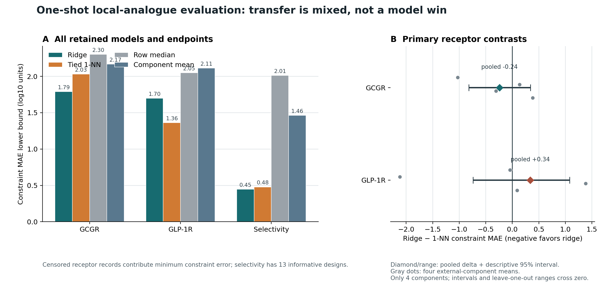

# Locked retrospective P1–P15 external evaluation

**Status:** completed once from the prediction-lock commit
`7feed50339e6695859efdddcd92efd7197c7d1d3`. The prediction-freeze command accepted no
receptor-outcome inputs and read only the P1–P15 sequence cells. Those predictions
were committed before this separate scoring command read the receptor outcomes.
The public labels were historically parsed for integrity audits, so this is
command-local isolation—not a blinded evaluation on previously unseen outcomes. The model was not
refit, recalibrated, or selected after this result.

## What was tested

The final component-balanced ridge model was trained on all 125 development
peptides after selecting alpha=10.0000 by the locked
leave-one-development-component-out rule. P1–P15 are nearby designed analogs
(not a distant-family panel), and their labels are public; this is a retrospective
locked retrospective external evaluation, not a blinded prospective experiment.

The endpoint is cAMP EC50 functional potency in pM—not binding affinity, Kd,
efficacy, or clinical performance. Three assay replicates were collapsed to one
peptide-level receptor observation. Exact triplicates use log10 of the arithmetic
mean. Any right-censored replicate produces a lower bound on that arithmetic mean;
the reported constraint loss is therefore an optimistic lower bound on absolute
error, not an exact error.

Observation statuses: `{'gcgr:exact': 12, 'gcgr:lower_bound': 3, 'glp1r:exact': 11, 'glp1r:lower_bound': 4, 'selectivity:exact': 10, 'selectivity:lower_bound': 1, 'selectivity:uninformative': 2, 'selectivity:upper_bound': 2}`.

## Results

| Model | Endpoint | Informative n | Constraint MAE lower bound | Exact-only n | Exact-only MAE | Bounds | Bound satisfaction |
|:---|:---|---:|---:|---:|---:|---:|---:|
| ridge | gcgr | 15 | 1.791 | 12 | 1.425 | 3 | 0.000 |
| ridge | glp1r | 15 | 1.699 | 11 | 0.947 | 4 | 0.000 |
| ridge | selectivity | 13 | 0.447 | 10 | 0.427 | 3 | 0.333 |
| nn | gcgr | 15 | 2.031 | 12 | 1.697 | 3 | 0.000 |
| nn | glp1r | 15 | 1.361 | 11 | 0.988 | 4 | 0.000 |
| nn | selectivity | 13 | 0.479 | 10 | 0.622 | 3 | 1.000 |
| median | gcgr | 15 | 2.301 | 12 | 2.559 | 3 | 0.000 |
| median | glp1r | 15 | 2.050 | 11 | 1.467 | 4 | 0.000 |
| median | selectivity | 13 | 2.013 | 10 | 1.957 | 3 | 0.000 |
| component_mean | gcgr | 15 | 2.167 | 12 | 2.225 | 3 | 0.000 |
| component_mean | glp1r | 15 | 2.112 | 11 | 1.666 | 4 | 0.000 |
| component_mean | selectivity | 13 | 1.463 | 10 | 1.340 | 3 | 0.000 |

`ridge` is the locked model; tied `nn` is its primary comparator. `median` is the
existing all-development-row receptor median. `component_mean` is a separately
named component-balanced intercept. Exact-only point metrics are descriptive
because censoring makes that subset non-random.

## Plain conclusion

There is **no overall external superiority result**. The ridge model's GCGR point
estimate is favorable relative to tied 1-NN (delta **-0.241** log10 units), but
the four-component descriptive interval (**-0.818 to 0.343**) and the
leave-one-component-out range (**-0.553 to 0.047**) both cross zero.

For GLP-1R, the pooled result is unfavorable: ridge constraint MAE is **1.699**
versus **1.361** for 1-NN (delta **+0.337**). It is also strongly sensitive to
dependence weighting. The four external-component mean deltas span **-2.120 to
+1.380**; the negative extreme is the singleton P11 component, whereas the
five-member P6--P10 component is strongly positive. The GLP-1R
leave-one-component-out range (**-0.184 to 0.513**) reverses direction. Therefore,
neither receptor supports a robust model-win claim.

This GLP-1R instability is also visible in the weighting choice: the pooled
ridge-minus-1-NN delta is **+0.337**, while all three predeclared group-macro
deltas are negative. That pooled-versus-macro sign reversal means the conclusion
depends on how the unequally sized, related design groups are weighted; the
macro-only direction-stability flag in the receipt must not be read as overall
stability.

Selectivity is an exploratory secondary signal, not a headline endpoint. Among
the 10 complete cases, ridge versus 1-NN has MAE **0.427 versus 0.622**, R2
**0.805 versus 0.607**, and Spearman rho **0.733 versus 0.881**. Across 13
informative exact-or-bounded records, constraint MAE is **0.447 versus 0.479**.
No component-resampling uncertainty was predeclared for selectivity, so these
point estimates cannot establish a selectivity advantage.

### Paired comparisons

Delta is challenger loss minus comparator loss; negative favors the challenger.
The headline descriptive interval uses 10,000 paired resamples of the four frozen
P1–P15 sequence components at aligned identity 0.85. A sampled component retains
all member peptides, and the same seed and component draws are used for every model
comparison. This is not an inferential confidence interval. Four components are
too few for a significance or superiority claim, regardless of interval position.
The designs share a model-guided design process, so dependence may remain even
across these four components.

| Endpoint | Comparison | Delta | 95% descriptive resampling interval |
|:---|:---|---:|:---|
| gcgr | ridge - nn | -0.241 | [-0.818, 0.343] |
| gcgr | ridge - median | -0.510 | [-2.885, 2.448] |
| gcgr | ridge - component_mean | -0.377 | [-2.279, 1.780] |
| glp1r | ridge - nn | 0.337 | [-0.738, 1.080] |
| glp1r | ridge - median | -0.351 | [-0.668, 0.028] |
| glp1r | ridge - component_mean | -0.413 | [-0.971, 0.341] |

For the primary ridge-versus-1-NN comparison, all four leave-one-external-component-
out estimates are retained. The range—not a p-value—is a direct stability check.

| Endpoint | Minimum leave-one-component-out delta | Maximum delta |
|:---|---:|---:|
| gcgr | -0.553 | 0.047 |
| glp1r | -0.184 | 0.513 |

The receipt also retains three dependence sensitivities: five shared-nearest-donor
parent proxies, a deliberately naive 15-peptide design-group-stratified bootstrap,
and three combined development/external linked components summarized by macro and
leave-one-linked-component-out deltas. The naive peptide interval is expected to
be anti-conservative. The receipt classifies direction stability only across the
three group-macro contrasts; every leave-one-group-out estimate and range remains
separate and must be inspected rather than folded into that classifier.

Selectivity is GCGR log10(mean EC50) minus GLP-1R log10(mean EC50). When one
receptor is censored, interval arithmetic gives a one-sided selectivity bound;
when both are censored, the record is uninformative and excluded from selectivity
constraint loss. No censored threshold is treated as an exact outcome.

## Interpretation boundary

This result tests whether a simple sequence model transfers to 15 local analogs
designed from the same source dataset. It does not establish distant sequence-family
generalization, structure-aware causality, receptor binding affinity, or superiority
to the source paper's CNN—or even model superiority within this four-component
panel. All receptor endpoints, intended design groups,
comparators, censoring cases, and negative results are retained.

Machine-readable aggregate metrics are in
`reports/external_evaluation_metrics.csv`; the complete receipt, exact-only metrics,
group summaries, sensitivity analysis, hashes, and bootstrap output are in
`reports/external_evaluation_receipt.json`.
